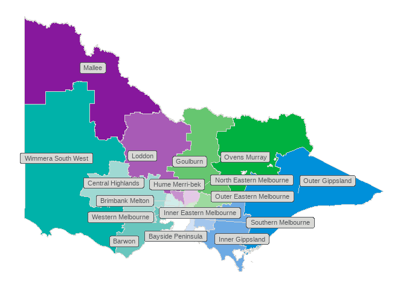

<!-- README.md is generated from README.Rmd. Please edit that file -->

# vicdffhmap

<!-- badges: start -->
<!-- badges: end -->

***vicdffhmap*** is a simple package containing sf objects for the
Victorian Department of Families, Fairness and Housing’s divisions and
areas.

The Department of Families, Fairness and Housing has four divisions and
17 areas.

Areas are groups of local government areas.

Divisions are groups of areas.

We have used this simple aggregation approach to create sf objects by
summarising objects obtained using `strayr::read_absmap("lga2021")`

## Installation

You can install the development version of vicdffhmap from
[GitHub](https://github.com/) with:

``` r
# install.packages("devtools")
devtools::install_github("zerogetsamgow/vicdffhmap")
```

## division_map

The following plot shows a map of the four divisionss which are
contained in `vicdffhmap::division_map`.

``` r
library(vicdffhmap)

## basic division_map
ggplot2::ggplot(
  division_map,
  ggplot2::aes(
    geometry = geometry,
    fill = division_name,
    label = division_name,
    x = cent_long,
    y = cent_lat
    )
  ) +
  ggplot2::geom_sf(
   colour = vpstheme::bv.smoke
   )+
  ggplot2::geom_label(
    colour = vpstheme::bv.charcoal, 
    fill = "grey", size = ggplot2::unit(7,"pt"))+
  vpstheme::scale_fill_dffh(palette = "core", reverse = TRUE, guide = "none")+
  ggthemes::theme_map()+
  ggplot2::theme(
    legend.position.inside = c(.7,.7)
  )
```


## area_map

The following plot shows a map of the 17 areas which are contained in
`vicdffhmap::area_map`

``` r
## basic area_map
ggplot2::ggplot(
  area_map,
  ggplot2::aes(
    geometry = geometry,
    fill = area_name,
    label = area_name,
    x = cent_long,
    y = cent_lat
    )
  ) +
  ggplot2::geom_sf(
   colour = vpstheme::bv.smoke
   )+
  ggrepel::geom_label_repel(
    colour = vpstheme::bv.charcoal, 
    fill = vpstheme::bv.smoke, size = ggplot2::unit(3,"pt"),
    max.overlaps = 20,
    segment.colour = vpstheme::bv.smoke)+
  ggplot2::scale_fill_manual(
    values = c(north_colours, west_colours, east_colours, south_colours), guide = "none")+
  ggthemes::theme_map()+
  ggplot2::theme(
    legend.position.inside = c(.7,.7)
  )
```



## clean_dffh_area()

To assist with joining datasets to the shapefiles, ***vicdffhmap***
exports the `clean_dffh_name()` function. This function will return
strings formatted as per the area_name variable in `area_map`. For
example:

``` r

clean_dffh_area("Hume moreland")
#> [1] "Hume Merri-bek"

clean_dffh_area("NE Melb")
#> [1] "North Eastern Melbourne"
```

The function can also be used to create abbreviated names for each area
with 15 or less characters.

## area_tbl

The package contains a third dataset `vicdffhmap::area_tbl` which shows
the mapping of local government areas, to areas, to divisions

``` r
## print full table of regions, areas and lgas
knitr::kable(
  area_tbl
)
```

| division_name  | area_name               | lga_name             | regional_lga |
|:---------------|:------------------------|:---------------------|:-------------|
| West division  | Wimmera South West      | Corangamite          | TRUE         |
| West division  | Wimmera South West      | Glenelg              | TRUE         |
| West division  | Wimmera South West      | Hindmarsh            | TRUE         |
| West division  | Wimmera South West      | Horsham              | TRUE         |
| West division  | Wimmera South West      | Moyne                | TRUE         |
| West division  | Wimmera South West      | Northern Grampians   | TRUE         |
| West division  | Wimmera South West      | Southern Grampians   | TRUE         |
| West division  | Wimmera South West      | Warrnambool          | TRUE         |
| West division  | Wimmera South West      | West Wimmera         | TRUE         |
| West division  | Wimmera South West      | Yarriambiack         | TRUE         |
| West division  | Barwon                  | Colac Otway          | TRUE         |
| West division  | Barwon                  | Greater Geelong      | TRUE         |
| West division  | Barwon                  | Surf Coast           | TRUE         |
| West division  | Barwon                  | Queenscliffe         | TRUE         |
| West division  | Central Highlands       | Ararat               | TRUE         |
| West division  | Central Highlands       | Ballarat             | TRUE         |
| West division  | Central Highlands       | Golden Plains        | TRUE         |
| West division  | Central Highlands       | Hepburn              | TRUE         |
| West division  | Central Highlands       | Moorabool            | TRUE         |
| West division  | Central Highlands       | Pyrenees             | TRUE         |
| West division  | Western Melbourne       | Hobsons Bay          | FALSE        |
| West division  | Western Melbourne       | Maribyrnong          | FALSE        |
| West division  | Western Melbourne       | Melbourne            | FALSE        |
| West division  | Western Melbourne       | Moonee Valley        | FALSE        |
| West division  | Western Melbourne       | Wyndham              | FALSE        |
| West division  | Brimbank Melton         | Brimbank             | FALSE        |
| West division  | Brimbank Melton         | Melton               | FALSE        |
| North division | Mallee                  | Mildura              | TRUE         |
| North division | Mallee                  | Swan Hill            | TRUE         |
| North division | Mallee                  | Buloke               | TRUE         |
| North division | Mallee                  | Gannawarra           | TRUE         |
| North division | Loddon                  | Campaspe             | TRUE         |
| North division | Loddon                  | Central Goldfields   | TRUE         |
| North division | Loddon                  | Greater Bendigo      | TRUE         |
| North division | Loddon                  | Loddon               | TRUE         |
| North division | Loddon                  | Macedon Ranges       | TRUE         |
| North division | Loddon                  | Mount Alexander      | TRUE         |
| North division | Hume Merri-bek          | Hume                 | FALSE        |
| North division | Hume Merri-bek          | Merri-bek            | FALSE        |
| North division | North Eastern Melbourne | Banyule              | FALSE        |
| North division | North Eastern Melbourne | Darebin              | FALSE        |
| North division | North Eastern Melbourne | Nillumbik            | FALSE        |
| North division | North Eastern Melbourne | Whittlesea           | FALSE        |
| North division | North Eastern Melbourne | Yarra                | FALSE        |
| East division  | Ovens Murray            | Alpine               | TRUE         |
| East division  | Ovens Murray            | Benalla              | TRUE         |
| East division  | Ovens Murray            | Indigo               | TRUE         |
| East division  | Ovens Murray            | Mansfield            | TRUE         |
| East division  | Ovens Murray            | Towong               | TRUE         |
| East division  | Ovens Murray            | Wangaratta           | TRUE         |
| East division  | Ovens Murray            | Wodonga              | TRUE         |
| East division  | Goulburn                | Greater Shepparton   | TRUE         |
| East division  | Goulburn                | Mitchell             | TRUE         |
| East division  | Goulburn                | Moira                | TRUE         |
| East division  | Goulburn                | Murrindindi          | TRUE         |
| East division  | Goulburn                | Strathbogie          | TRUE         |
| East division  | Outer Eastern Melbourne | Knox                 | FALSE        |
| East division  | Outer Eastern Melbourne | Maroondah            | FALSE        |
| East division  | Outer Eastern Melbourne | Yarra Ranges         | FALSE        |
| East division  | Inner Eastern Melbourne | Boroondara           | FALSE        |
| East division  | Inner Eastern Melbourne | Manningham           | FALSE        |
| East division  | Inner Eastern Melbourne | Monash               | FALSE        |
| East division  | Inner Eastern Melbourne | Whitehorse           | FALSE        |
| South division | Outer Gippsland         | East Gippsland       | TRUE         |
| South division | Outer Gippsland         | Wellington           | TRUE         |
| South division | Inner Gippsland         | Bass Coast           | TRUE         |
| South division | Inner Gippsland         | Baw Baw              | TRUE         |
| South division | Inner Gippsland         | Latrobe              | TRUE         |
| South division | Inner Gippsland         | South Gippsland      | TRUE         |
| South division | Southern Melbourne      | Cardinia             | FALSE        |
| South division | Southern Melbourne      | Casey                | FALSE        |
| South division | Southern Melbourne      | Greater Dandenong    | FALSE        |
| South division | Bayside Peninsula       | Bayside              | FALSE        |
| South division | Bayside Peninsula       | Frankston            | FALSE        |
| South division | Bayside Peninsula       | Glen Eira            | FALSE        |
| South division | Bayside Peninsula       | Kingston             | FALSE        |
| South division | Bayside Peninsula       | Mornington Peninsula | FALSE        |
| South division | Bayside Peninsula       | Port Phillip         | FALSE        |
| South division | Bayside Peninsula       | Stonnington          | FALSE        |
